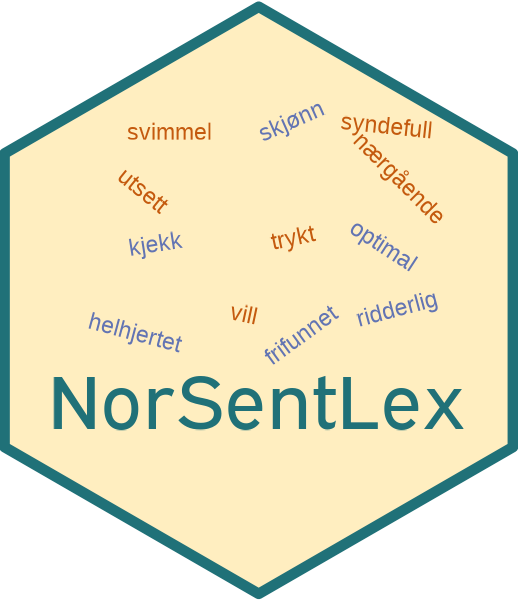

# NorSentLex 

<!-- badges: start -->
<!-- [](https://cran.r-project.org/package=stortingscrape) -->
[](https://github.com/martigso/NorSentLex)
<!-- [](https://cran.r-project.org/package=stortingscrape) -->
<!-- [](https://cran.r-project.org/package=stortingscrape) -->
<!-- [](https://github.com/martigso/stortingscrape/actions/workflows/check-standard.yaml) -->
<!-- badges: end -->


This repository is a R-format version of the [Norwegian sentiment lexicons](https://github.com/ltgoslo/norsentlex) as shown in Barnes et.al (2019). 

## Installation

The package can be installed by using the `install_github()` function from the `devtools` package in R:


```{r, eval=FALSE}

devtools::install.github("martigso/NorSentLex")
library(NorSentLex)

?nor_fullform_sent
?nor_lemma_sent
```

## Structure and usage

The package mirrors the structure of the vanilla [NorSentLex](https://github.com/ltgoslo/norsentlex) repository, but in a typical R type format. There are two available datasets: `nor_fullform_sent` and `nor_lemma_sent`. These can be easily loaded in R:

```{r}

data("nor_fullform_sent", package = "NorSentLex")
data("nor_lemma_sent", package = "NorSentLex")

```

The data are structured as follows:

| Token form | Sentiment | POS |
|:---------- |:----------|:----|
| Fullform    | Positive <br> Negative |TBD|
| Lemma      | Positive <br><br><br><br> Negative  |  adjective <br> noun <br> participle adjective <br> verb <br> adjective <br> noun <br> participle adjective <br> verb |


### Fullform

The fullform data contains a list with one element ("positive") of 6103 positive fullform tokens and one element ("negative") of 14839 negative fullform tokens. These can be extracted by name after loading the data into R (see above):

```{r}


nor_fullform_sent$positive |> 
  head()

nor_fullform_sent$negative |> 
  head()

```

### Lemma

The lemmatized part of the data contain a list element for positive and negative lexicons for each of the following parts-of-speech: adjective, noun, participle adjective, and verb:

```{r}
names(nor_lemma_sent)

```

These lexicons can also be extracted by calling the names within the list:

```{r}

nor_lemma_sent$lemma_noun_positive |> 
  tail()

```

## References

Barnes et al. (2019) Lexicon information in neural sentiment analysis: a multi-task learning approach. Proceedings of the 22nd Nordic Conference on Computational Linguistics. Turku, Finland [ACL Anthology](https://www.aclweb.org/anthology/W19-6119/)
